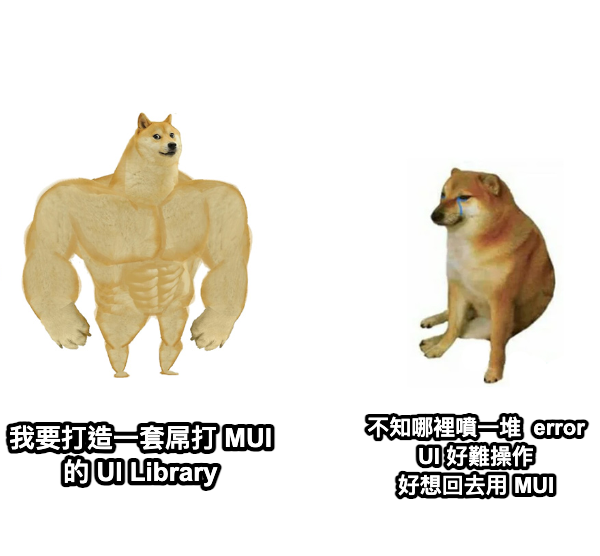

<br />
<br />
<br />
<br />
<br />
<br />

# Building Your Own UI Library from Scratch

<!--
The last comment block of each slide will be treated as slide notes. It will be visible and editable in Presenter Mode along with the slide. [Read more in the docs](https://sli.dev/guide/syntax.html#notes)
-->

---

# Outline

- **Development** - Storybook + React
- ~~Testing - Jest~~
- **Documentation** - ~~doc.mdx~~ Storybook 7 autodoc
- **Packaging** - Rollup
- **Release** - npm publish
- **Reflections**

---

# Init Storybook
[Tutorial](https://storybook.js.org/tutorials/intro-to-storybook/react/zh-TW/get-started/)
```
# Clone the template
npx degit LightLai813/build-own-ui-library ui-library

cd ui-library

# Install dependencies
npm install

# Start the component explorer on port 6006:
npm run storybook
```

---

## Tips - 相同的 layout 共用 component

---

## Tips - 使用大家習慣的 props 命名

---

## Tips - 保留 otherProps 設定

---

# Write Document
```
interface ButtonProps {
  /** 按鈕顯示文字 */
  label: string

  /** 預設樣式 */
  primary?: boolean, 

  /** 按鈕底色 */
  backgroundColor?: string, 

  /** 按鈕尺寸 */
  size?: 'small'|'medium'|'large', 

  /** click event */
  onClick?: () => void
}
```


---

# Packaging with Rollup
Rollup 的設計初衷主要是針對庫（libraries）和模組，所以它在這方面有一些特定的優勢：

- **效率高的打包**：Rollup 使用的算法可以更精確地分析代碼間的依賴關係，這有助於創建更小的打包文件。
- **預設支援 Tree-shaking**：這個功能允許 Rollup 在打包時移除未使用的代碼，對於製作精簡的庫尤其有用。
- **輸出格式多樣化**：Rollup 支援多種輸出格式，包括 CommonJS、AMD、ES 模組等，讓你的庫能在不同的環境中運行。
- **配置簡單**：相比 Webpack 的繁瑣配置，Rollup 的配置通常更加簡單直觀。
- **源碼輸出更簡潔**：Rollup 打包出的文件通常更接近手工編寫的源碼，這對於庫的作者來說可以讓源碼更易於理解和維護。
- **性能優化**：對於小到中型的庫和模組，Rollup 的打包速度通常較快。
- **適合庫的開發**：Rollup 在設計之初就專門針對庫的開發，因此它在這方面的特性和優化非常成熟。

不過，這並不意味著 Rollup 在所有情況下都是最佳選擇。例如，對於大型的應用開發，Webpack 的豐富插件和更靈活的配置可能更適合。
總的來說，如果您正在開發一個 UI Library 或其他類型的庫，Rollup 的這些優勢可能會讓它成為一個吸引人的選擇。

---

# 輸出格式
## main (cjs)
- 用途：指定 Node.js 環境下的入口文件，也是大部分打包工具的默認入口。
- 格式：通常是 CommonJS 格式。

## module (esm)
- 用途：提供給支持 ES 模組語法的現代打包工具（例如 Rollup 和 Webpack 2+）的入口。
- 格式：通常是 ES 模組格式，可以利用 Tree-shaking 來移除未使用的代碼。

## browser (umd)
- 用途：專門為瀏覽器環境提供的入口點。當你的庫有一些瀏覽器專用的代碼時，可以使用這個字段。
- 格式：可以是 UMD 格式或其他瀏覽器支持的格式。

---

# Release

```
npm publish
```
[Creating and publishing private packages](https://docs.npmjs.com/creating-and-publishing-private-packages)

[Creating and publishing scoped public packages](https://docs.npmjs.com/creating-and-publishing-scoped-public-packages)


---

# Reflections

## Pros
- 可以在多個 Repo 使用相同 component
- 擴充調整需求相對彈性
- 面試非常非常加分 
<br />
<br />

---

# Reflections

## Cons
- 修改完後，要發佈之後，其他專案才可以使用 --> monorepo
- UIUX 也是一門專業知識，若沒有專業 UI designer 配合，產出的 Component 可能不符合大眾使用習慣 [Material UI Guideline](https://m3.material.io/components)
- 人力不足時，更新迭代不如第三方套件快



---


# Reference
- [30 天擁有一套自己手刻的 React UI 元件庫](https://ithelp.ithome.com.tw/2020-12th-ironman/articles/3999)
- [32K star 的 Chakra UI，以及未来的展望](https://juejin.cn/post/7249286405024776249?utm_source=gold_browser_extension)
<br />
<br />

- [MUI - Github](https://github.com/mui/material-ui)
- [Ant Desing - Github](https://github.com/ant-design/ant-design)
- [Chakra UI - Github](https://github.com/chakra-ui/chakra-ui)
- [Semantic UI - Github](https://github.com/Semantic-Org/Semantic-UI)
---

